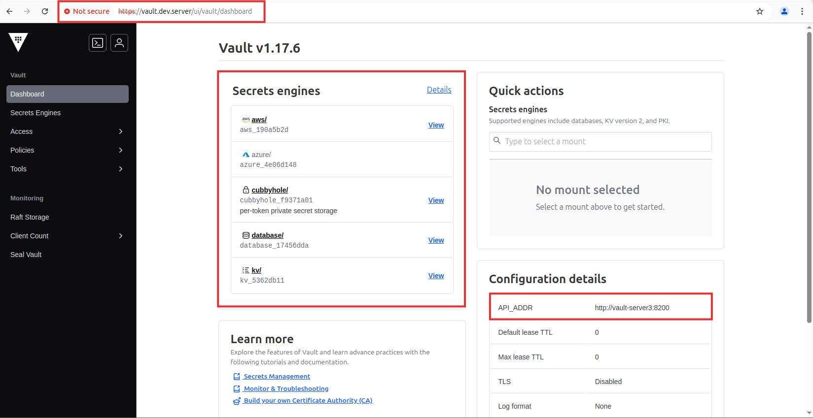

# Using docker compose to create vault and create Load Balancing using NGINX
This project demonstrates how to run a **HashiCorp Vault development cluster** using **Docker Compose**, and configure **NGINX** as a reverse proxy load balancer to route requests across Vault instances.

---

## 📌 Project Structure

<pre><code>vault-docker-compose-v3/

├── cert-script/
│   └── cert.sh
├── vault-server1/
│   ├── config/
│   │   └── vault-config.hcl
│   │── file/
│   └── logs/
├── vault-server2/
│   ├── config/
│   │   └── vault-config.hcl
│   │── file/
│   └── logs/
├── vault-server3/
│   ├── config/
│   │   └── vault-config.hcl
│   │── file/
│   └── logs/
├── unseal-script/
│   ├── vault-init.sh
│   └── vault-raft-join.txt
├── nginx.conf
└── docker-compose.yml 

</code></pre>

---
## Directory Explanation
- **`cert-script/`**
  - Contains the `cert.sh` script for generating self-signed TLS certificates to enable secure HTTPS communication for Vault and NGINX.

- **`vault-server1/`, `vault-server2/`, `vault-server3/`**
  - These are three independent Vault server nodes used to simulate a Vault development cluster with high availability. Each server includes:

     - `config/`: Vault configuration file (vault-config.hcl)

     - `file/`: Storage directory used by the Vault servers (Raft)

     - `logs/`: Log output directory for each server
   
- **`unseal-script/`**
  - The automation script for unsealing the Vault servers after startup.

    - `vault-init.sh`: Script that is used by the leader node to initialize the vault server and unseal the vault
    - `vault-raft-join.sh`: Script that is used by standby nodes to join raft vault server1 and also unseal the vault
   
- **`nginx.conf/`**
  - NGINX configuration file that acts as a reverse proxy and load balancer in front of the Vault nodes, forwarding requests to healthy instances.

- **`docker-compose.yml`**
  - Main Docker Compose file that create and automate the entire Vault cluster, including all three Vault servers, NGINX, and network configuration.
 
---

## 🗺️ Architecture Diagram
Here's a rough visual of the architecture:

---

## 🧪 Testing Vault Cluster Functionality
Can access vault server using https. Since I used self signed SSL which is not browser friendly it will be saying connection not secure. 

 

In Here Vault-Server1 is the leader among 3 vaults  

 

Also in GUI 

 

I created some secrets in Vault Server and stop the Vault-Server1. Vault-Server1 is down and Leader Vault Server is re-elected.  

 

Now I am accessing the same name on https but the Leader Vault Server is now Vault-Server3. Also, secrets are still there. 

 

**⚙️ How It Works**
- Vault Servers (3x) — Initialized with identical config and launched as containers.

- NGINX Load Balancer — Sits in front of all Vault nodes and balances traffic across them.

- TLS Setup — Self-signed certs generated by cert.sh for encrypted HTTPS communication.

- Unseal Script — Automates unsealing process using the saved keys from initialization.
---

**🛡️ Notes for future Development**
- This is for testing and learning purposes only. So better not use in production without securing access, storage backend, and proper ACL policies.

